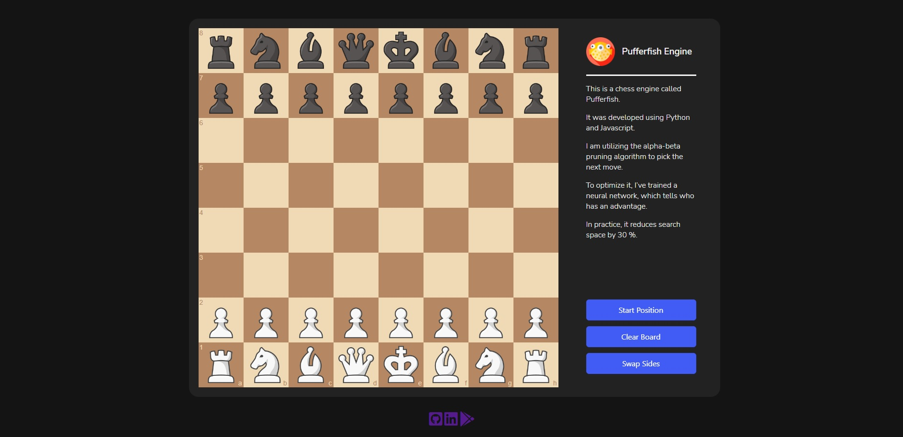

<div align="center">
  <a href="https://github.com/othneildrew/Best-README-Template">
    
  </a>

  <h3 align="center">PufferFish Chess Engine</h3>

  <p align="center">
    A compact chess engine written in Python and Javascript
    <br />
    <br />
    <br />
    <a href="" style="">View Demo(Soon)</a>
    ·
    <a href="https://github.com/ArtemLashko/PufferFish/issues">Report Bug</a>
    ·
    <a href="https://github.com/ArtemLashko/PufferFish/issues">Request Feature</a>
  </p>
</div>

<!-- ABOUT THE PROJECT -->
## About The Project

<p>This is a chess engine/interface created using Flask.</p>
<p>It utilizes the artificial intelligence algorithm Alpha-Beta pruning algorithm with the help of a neural network model.
to reduce search domain and increase performance.
</p>
<p>Front-end</p>
<li>Javascript</li>
<li>CSS</li>
<li>HTML</li>
<p>Back-end</p>
<li>Python</li>
<li>Flask</li>
<li>Keras</li>

<!-- Machine learning -->
## Machine learning

<p>The model was trained with 3.5 million examples of board/class.</p>
<p>The board is represented as 768 columns (2 sides * 6 figures * 8 rows * 8 columns).</p>
<p>There are three types of classes:</p>
<li> 0 - Black has an advantage of 1.5 pawns or more.</li>
<li> 1 - Black or white has an advantage of fewer than 1.5 pawns.</li>
<li> 2 - White has an advantage of 1.5 pawns or more.</li>
<p>I've used this model to reduce the domain of search. In the table below, you can see how 
it affects the number of considered moves.</p>
<p>In all examples, I've used 1000 random chess positions. They weren't used in either training or validation.</p>

| Layers affected | Alpha-beta with ML | Standard alpha-beta | Difference(%) |
|-----------------|:------------------:|--------------------:|--------------:|
| 1               |       65209        |               70572 |        7.599% |
| 2               |      45730.65      |               70572 |       35.200% |
| 3               |      44236.84      |               70572 |       37.316% |

<p>We can see that if the number of layers where machine learning was used increases, the search domain decreases.</p>
<p>In practice, two layers are the optimal solution.</p>
<p align="right">(<a href="#readme-top">back to top</a>)</p>

<!-- ROADMAP -->
## Roadmap

- [x] Implement minimax algorithm
- [x] Implement alpha-beta algorithm
- [x] Develop front-end for a computer
- [ ] Develop front-end for a mobile phone
- [ ] Implement MTD(f) algorithm
- [ ] Develop an Android app

<p align="right">(<a href="#readme-top">back to top</a>)</p>

<!-- Installation -->
## Installation
1. Clone the repo
   ```sh
   git clone https://github.com/ArtemLashko/PufferFish
   ```
2. Install requirements
   ```sh
   pip install -r requirements.txt
   ```
3. Run Flask server
    ```sh
   python app.py
   ```
<br>
<p align="right">(<a href="#readme-top">back to top</a>)</p>
<br>